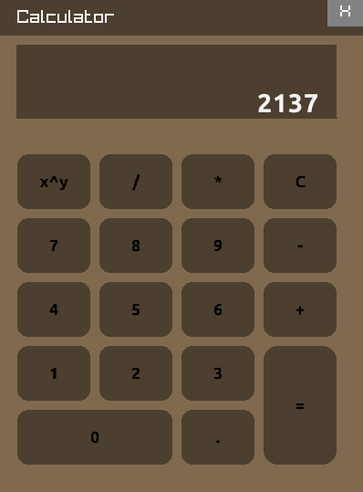

# Calculator
A simple C++ calculator using Raylib.

## Features

- Basic arithmetic operations
- Simple GUI with Raylib
- Lightweight and fast

## Screenshots

 

## Installation
Fast and painless:
1. Clone the repository.
2. Extract `Calculator.zip`.

Or:

1. Clone the repository.
2. Install Raylib.
3. In RayLibs's `w64devkit` get in the same folder as `main.cpp` and run:
```bash
g++ main.cpp resources.o -o Calculator.exe -mwindows -lraylib -lopengl32 -lgdi32 -lwinmm
```

Feel free to experiment with different button layouts by editing this part:
```bash
Button buttons[] = {
        {{20, 170, 80, 60}, "x^y"}, {{110, 170, 80, 60}, "/"}, {{200, 170, 80, 60}, "*"}, {{290, 170, 80, 60}, "C"},
        {{20, 240, 80, 60}, "7"}, {{110, 240, 80, 60}, "8"}, {{200, 240, 80, 60}, "9"}, {{290, 240, 80, 60}, "-"},
        {{20, 310, 80, 60}, "4"}, {{110, 310, 80, 60}, "5"}, {{200, 310, 80, 60}, "6"}, {{290, 310, 80, 60}, "+"},
        {{20, 380, 80, 60}, "1"}, {{110, 380, 80, 60}, "2"}, {{200, 380, 80, 60}, "3"}, {{290, 380, 80, 130}, "="},
        {{20, 450, 170, 60}, "0"}, {{200, 450, 80, 60}, "."}
    };
```
Basically have fun.
